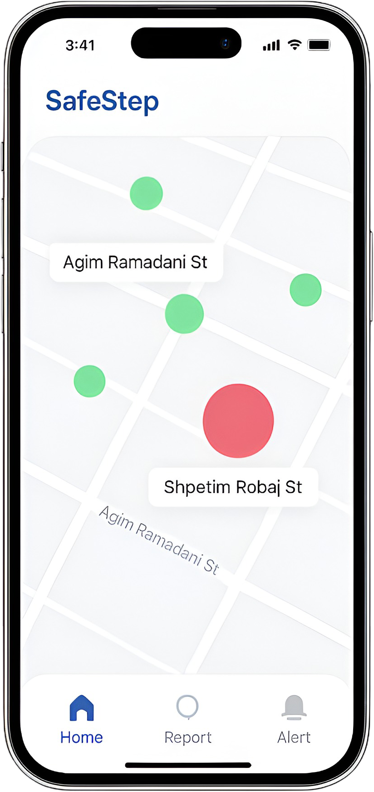
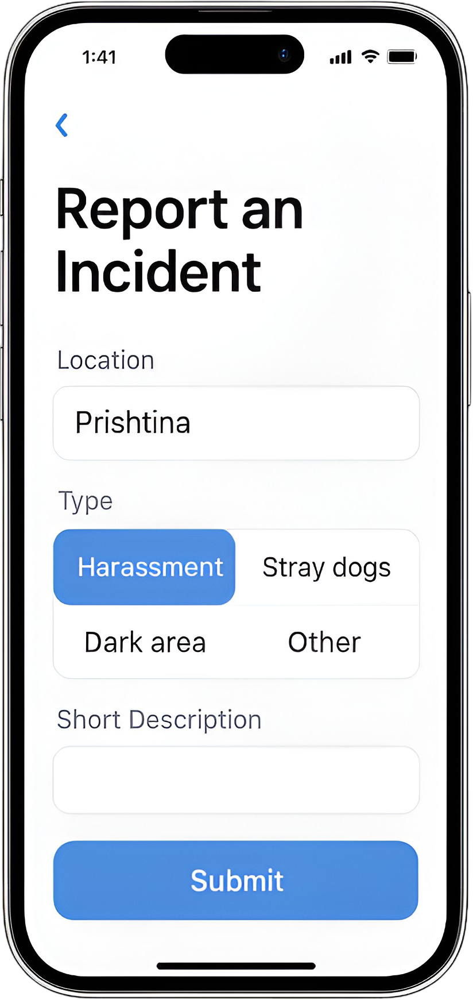
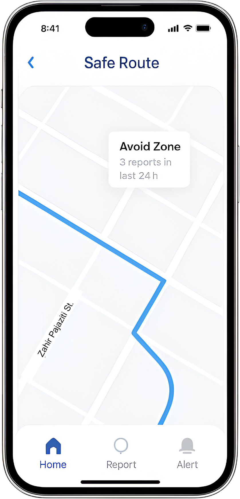

# 🛡️ SafeStep – Real-Time Street Safety App

SafeStep is a mobile-first app that helps people avoid unsafe streets based on real-time community reports.

Whether it's harassment, stray dogs, or poorly lit roads; SafeStep maps it all and shows you safer routes instantly.

---

## 📱 Key Features

- **Live safety map** showing red (danger) and green (safe) zones  
- **One-tap danger reports**: harassment, stray dogs, dark areas  
- **Smart route planner** that avoids unsafe locations  
- **Emergency alert system** to notify trusted contacts  
- **Community-powered, AI-enhanced detection**

---

## 🌍 Use Cases

- Safer walks home for students and women  
- Community awareness for dangerous zones  
- Potential use by NGOs and local authorities  
- Real-time alerts during city events or crises

---

## 🖼️ Screenshots

| Home Safety Map | Report Incident | Safe Route |
|-----------------|------------------|------------|
|  |  |  |

---

## ⚙️ Tech Stack (Planned)

- React Native for mobile  
- Firebase (Auth + Database)  
- Google Maps API  
- GPT-4 (moderation & trends)  
- Crime/incident APIs (future)

---

## 🚀 Next Steps

- [ ] Build MVP UI  
- [ ] Add location-aware reporting  
- [ ] Integrate AI risk detection  
- [ ] Partner with local orgs

---
